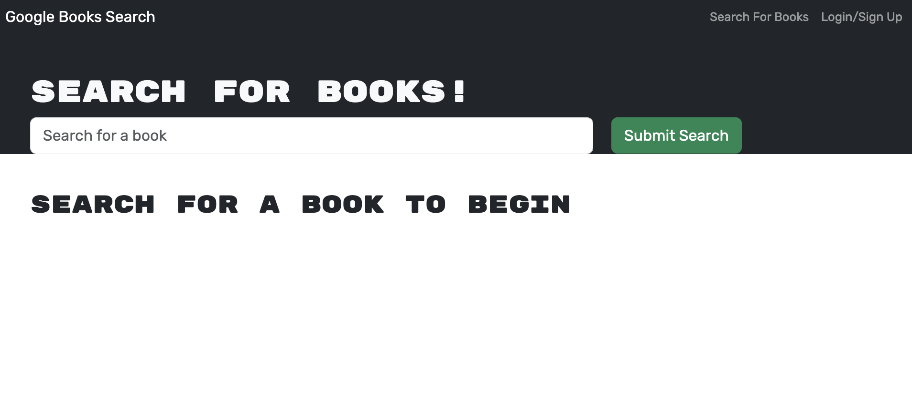
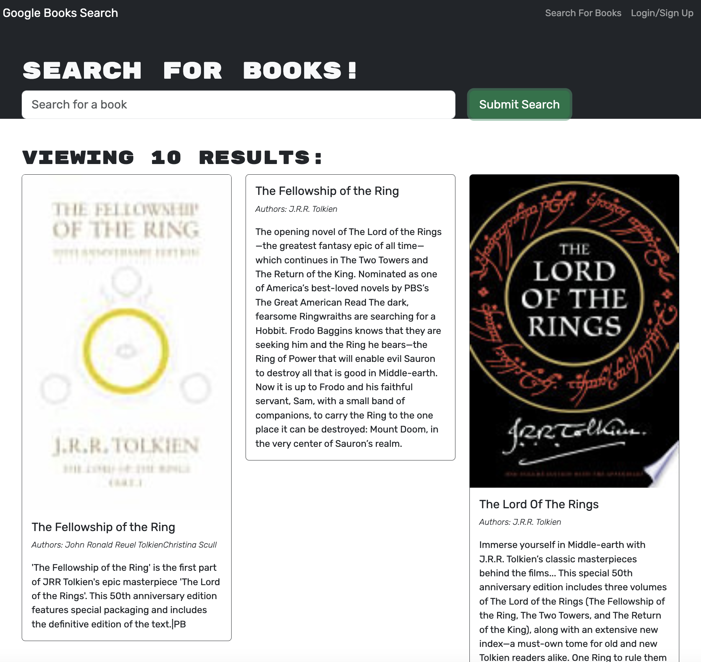

# Book Search Engine

## Description
This project was created for avid book readers to keep a list of books they want to read. This application helps the reader keep track of the book information all in one place.

## Installation
GitHub Repository: https://github.com/renrojas/book-search-engine
Heroku: https://mysterious-waters-26915-6cdf323b23ff.herokuapp.com/

## Usage
1. To navigate this application, you open the Heroku link and it will take you to the homepage.

2. You can then type up a search to get the book results available. 

3. In order to save books, you will need to sign up. Click Sign Up at the top right of the page.

4. Once signed up, you will be logged in and you will be able to search books and save them by clicking on the button "Save this Book" under the book description.

5. To access your saved books, and/or delete them, click on the top right where it says "See Your Books" and you will see your saved books.

## Credits

https://graphql.org/graphql-js/ - GraphQL Documentation

https://www.apollographql.com/docs/ - Apollo Server Documentation

https://github.com/coding-boot-camp -  University of Denver’s GitLab course material (DU-VIRT-FSF-PT-04-2023-U-LOLC) and starter Code

https://coding-boot-camp.github.io/full-stack/mongodb/how-to-set-up-mongodb-atlas and https://coding-boot-camp.github.io/full-stack/mongodb/deploy-with-heroku-and-mongodb-atlas - Heroku Deployment Guide

https://www.w3schools.com/js/default.asp - W3 schools

## License
MIT License

Copyright (c) 2023 renrojas

Permission is hereby granted, free of charge, to any person obtaining a copy
of this software and associated documentation files (the "Software"), to deal
in the Software without restriction, including without limitation the rights
to use, copy, modify, merge, publish, distribute, sublicense, and/or sell
copies of the Software, and to permit persons to whom the Software is
furnished to do so, subject to the following conditions:

The above copyright notice and this permission notice shall be included in all
copies or substantial portions of the Software.

THE SOFTWARE IS PROVIDED "AS IS", WITHOUT WARRANTY OF ANY KIND, EXPRESS OR
IMPLIED, INCLUDING BUT NOT LIMITED TO THE WARRANTIES OF MERCHANTABILITY,
FITNESS FOR A PARTICULAR PURPOSE AND NONINFRINGEMENT. IN NO EVENT SHALL THE
AUTHORS OR COPYRIGHT HOLDERS BE LIABLE FOR ANY CLAIM, DAMAGES OR OTHER
LIABILITY, WHETHER IN AN ACTION OF CONTRACT, TORT OR OTHERWISE, ARISING FROM,
OUT OF OR IN CONNECTION WITH THE SOFTWARE OR THE USE OR OTHER DEALINGS IN THE
SOFTWARE.
